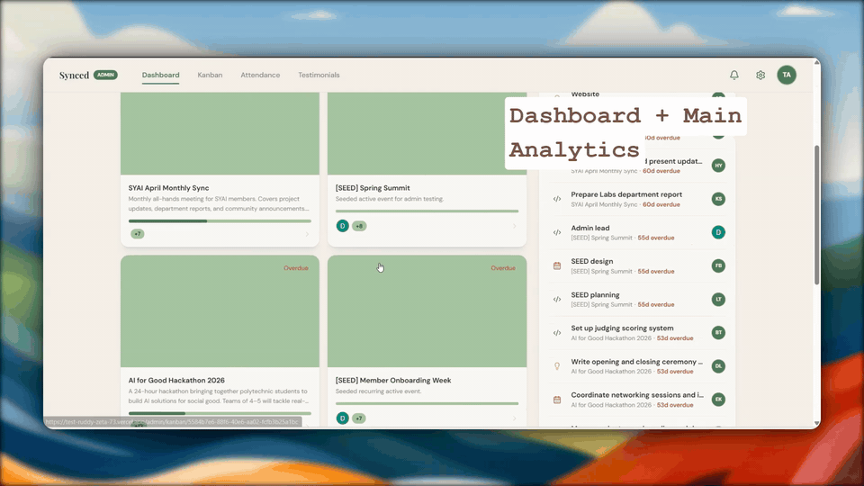
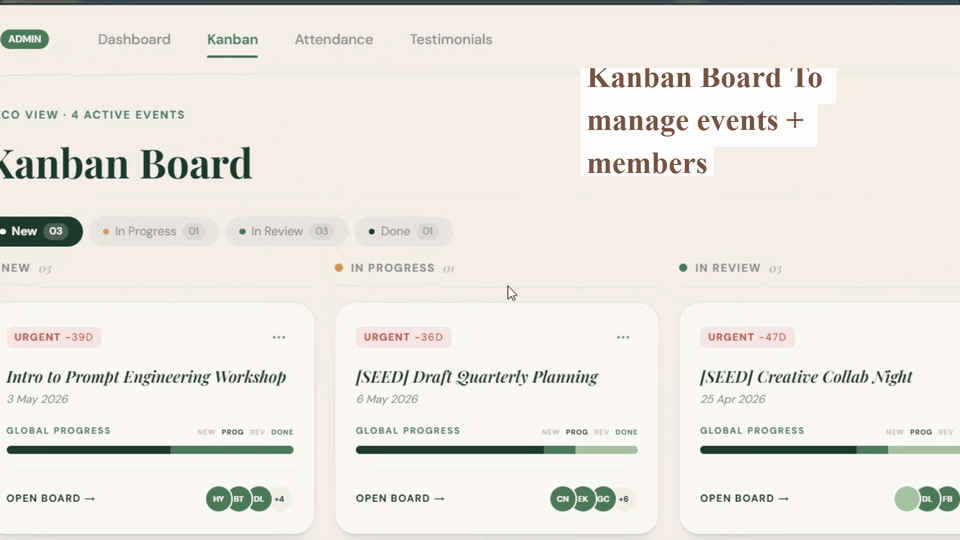
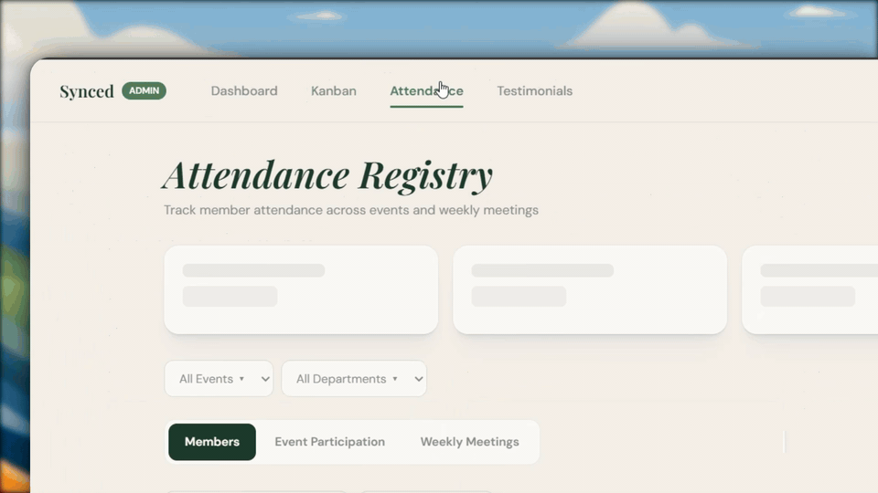
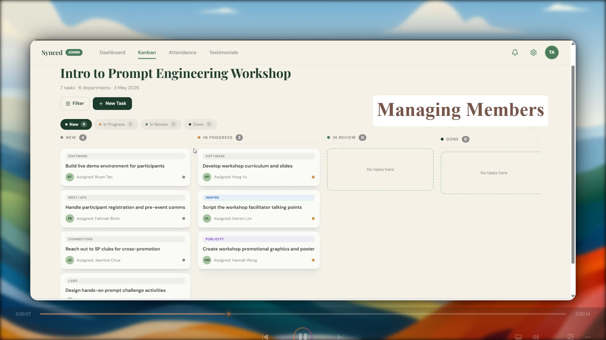
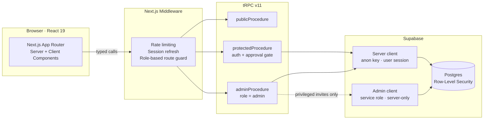
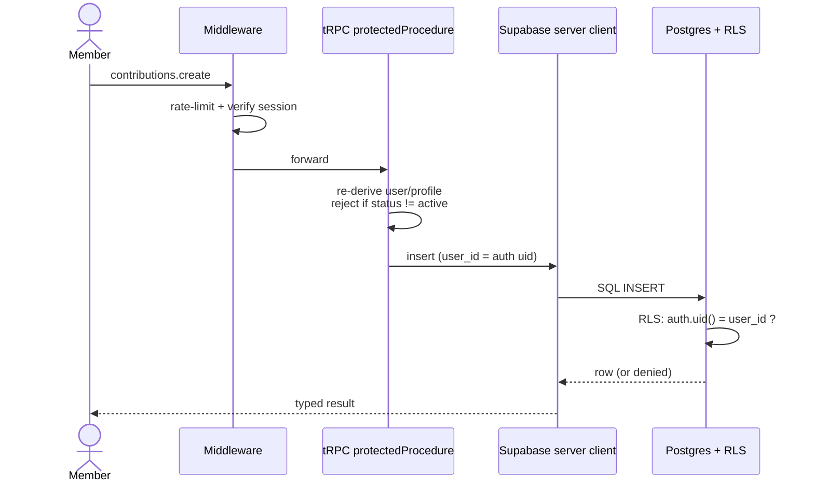

# Synced


> **Streamlining hierarchical event inefficiencies — while cultivating proactivity in members toward organisational and personal growth.**

Synced is a role-aware platform for volunteer-run organisations. Admins run events, tasks, and attendance from one place; members see exactly what they own, log the **impact** of what they deliver, and turn that impact into recognition — so people are rewarded for outcomes, not hours.



---

## The Problem

Volunteer organisations run on goodwill but break on coordination. As they grow, the same failure pattern repeats:

- **Top-down bottlenecks** — every decision and task routes through a small group of leads, who spend more time chasing updates than leading.
- **Passive membership** — members wait to be told what to do because ownership and progress are invisible.
- **Impact disappears** — contributions live in chats and spreadsheets, so recognition defaults to "who showed up" instead of "who moved the needle."

Synced was designed against the **real operational pain of a volunteer-run organisation**, then built to generalise — the same model fits any non-profit or community group that coordinates events through a hierarchy of leads and members.

### Design-thinking lens

This wasn't a feature-first build. It was scoped through the **desirability → feasibility → viability** lens before code:

| Lens | Question | Decision it drove |
|---|---|---|
| **Desirability** | What do members and admins actually want? | Members want their effort *seen* and tied to growth; admins want to stop chasing. → An **impact loop** that ends in real recognition (testimonials/endorsements), not vanity points. |
| **Feasibility** | Can one developer build this securely? | Role-aware, multi-user data is risky to hand-roll. → **RLS-first** on Supabase + typesafe tRPC means access rules live in the database, not scattered across UI. |
| **Viability** | Will it survive past the demo and transfer? | Volunteer orgs have no budget and high churn. → Managed Postgres/Auth (low cost), an **admin approval gate**, and a domain model generic enough to re-skin for any org. |

---

## The Impact Loop

Synced is built around one deliberate loop that converts effort into growth:

1. **Plan** — Admins create events and assign tasks across departments on a kanban board.
2. **Own** — Members pick up their tasks and advance them through `new → in progress → in review → done` (forward-only, so progress is honest).
3. **Log impact** — On completion, members record a **contribution**: the task, its **outcome**, and a **priority** that reflects difficulty.
4. **Reflect** — Members capture what they learned — split into **personal growth** and **organisational growth** — turning work into development.
5. **Surface** — Impact rolls up into dashboards and KPIs for both members and admins in real time.
6. **Recognise** — High-impact, reflected work becomes **testimonials and endorsements** — recognition earned by outcome, which motivates members to take on harder challenges (like partnerships) regardless of seniority.

---

## Who It's For

**Admins / organisers** who:
- coordinate recurring events across multiple departments and leads,
- need a bird's-eye view of who owns what and what's stuck,
- want to recognise contributors fairly instead of by visibility.

**Members / volunteers** who:
- want to see their own tasks and progress without being chased,
- want their effort to count toward something real (a testimonial, a skill, a growth record),
- prefer a clear system of ownership over scattered group chats and spreadsheets.

---

## Features

| Member dashboard & analytics | Kanban ownership | Attendance management |
|:---:|:---:|:---:|
|  |  |  |

| Event detail |
|:---:|
|  |

**Admin side** — KPI dashboard, bird's-eye kanban across all events, attendance (event + weekly-meeting) tracking, member approval, and testimonial generation/moderation.

**Member side** — personal dashboard with growth KPIs, a focused kanban of owned tasks, contribution logging, reflection submission, and testimonial requests.

---

## Architecture



**Architecture snapshot** — each choice paired with the reason it's there:

- **Next.js 15 App Router** — server components fetch data close to the source; client components handle interactive boards and forms.
- **tRPC v11** — one end-to-end-typed contract from Postgres to React, so a schema change surfaces as a compile error, not a runtime 500.
- **Supabase (Postgres + Auth + RLS)** — identity, data, and authorisation in one managed layer; **RLS is the access boundary**, enforced even if application code is wrong.
- **Server-only admin client** — the service-role key lives behind an `import "server-only"` guard and is used **only** for privileged operations (e.g. inviting a member), never shipped to the browser.

---

## Security & Data Access

Authorisation is **defence in depth** — three independent layers, so no single mistake exposes data:

1. **Middleware** — rate-limits auth/API routes and guards routes by role (members can't reach `/admin/*`, admins can't reach `/member/*`).
2. **tRPC procedures** — `protectedProcedure` re-derives the user and profile per request and enforces an **approval gate** (new signups are `pending` until an admin activates them); `adminProcedure` additionally requires `role = admin`.
3. **Row-Level Security** — the database itself rejects unauthorised reads/writes, regardless of what the API does.



The RLS policies are real, not decorative — a role check backed by a `security definer` helper, and ownership checks via `auth.uid()`:

```sql
-- Admin capability, centralised in one helper
create or replace function public.is_admin()
returns boolean language sql stable security definer
set search_path = 'public' as $$
  select exists (
    select 1 from public.profiles p
    where p.id = auth.uid() and p.role = 'admin'
  );
$$;

-- Admins manage all attendance; members are blocked at the DB
create policy "Admins manage all attendance"
  on public.attendance for all to authenticated
  using (public.is_admin());

-- Members can only ever read their own profile
create policy "Profiles: owner or admin can select"
  on public.profiles for select to authenticated
  using ((auth.uid() = id) or public.is_admin());
```

**Security checklist**

- ✅ Row-Level Security on every table — `auth.uid()` ownership + `is_admin()` role policies
- ✅ Zod validation on every tRPC input
- ✅ Approval gate — accounts start `pending`, activated only by an admin
- ✅ Server-only service-role client (`import "server-only"`), never exposed to the browser
- ✅ Role-based route guarding + rate limiting in middleware
- ✅ End-to-end typesafe API — no untyped REST surface

---

## Tech Stack

**Frontend**

| Technology | Purpose |
|---|---|
| Next.js 15 (App Router) | React framework, server components, routing |
| React 19 + TypeScript | Typed component model end to end |
| Tailwind CSS v4 | Utility-first, CSS-first styling |
| Radix UI + shadcn-style primitives | Accessible dialogs, menus, forms |
| TanStack Query (via tRPC) | Server-state caching + optimistic updates |

**Backend & data**

| Technology | Purpose |
|---|---|
| tRPC v11 | End-to-end typesafe API procedures |
| Supabase Auth | Identity, sessions (SSR cookie-based) |
| PostgreSQL + RLS | Relational store; authorisation boundary |
| Postgres RPC functions | `security definer` KPIs + `create_event`, `is_admin` |
| Zod | Runtime validation at every API boundary |

**Testing**

| Technology | Purpose |
|---|---|
| Vitest + Testing Library | Unit + integration tests (jsdom / node) |
| Playwright | End-to-end flows with role-based auth state |

---

## Project Structure

```
src/
├── app/                       # Next.js App Router
│   ├── (auth)/login/          # Auth routes
│   ├── (marketing)/           # Public landing pages
│   ├── admin/                 # Admin-only routes (role-gated)
│   │   ├── dashboard/         #   KPIs + ongoing initiatives
│   │   ├── kanban/            #   bird's-eye board across all events
│   │   ├── attendance/        #   event + weekly-meeting tracking
│   │   └── testimonials/      #   endorsement generation/moderation
│   ├── member/                # Member-only routes (role-gated)
│   │   ├── dashboard/         #   personal growth KPIs
│   │   ├── kanban/            #   owned tasks only
│   │   └── testimonials/      #   request + view endorsements
│   ├── api/trpc/              # tRPC HTTP handler
│   └── _components/           # Feature-grouped UI (admin, kanban, ui, …)
├── server/api/
│   ├── root.ts                # appRouter composition
│   ├── trpc.ts                # context + public/protected/admin middleware
│   └── routers/               # auth, events, kanban, contributions, …
├── lib/supabase/
│   ├── server.ts              # SSR server client (anon key)
│   ├── client.ts              # browser client (anon key)
│   └── admin.ts               # service-role client (server-only)
├── types/database.ts          # generated Supabase types
└── middleware.ts              # auth guard + rate limiting
supabase/migrations/           # SQL migrations + RLS policies
```

---

## tRPC API

Procedures are grouped by domain — the router map doubles as the service boundary:

**`events`** *(protected)* — `list`, `getById`, `create` (admin-enforced via RPC), `updateStatus`
**`kanban`** — member: `getMemberKanban`, `moveTask` (forward-only, ownership-scoped), `updateOwnContribution`; admin: `getAdminBirdsEye`, `adminMoveTask`, `adminCreateTask`
**`contributions`** *(protected)* — `list` (own), `listAll` (admin), `create`, `update` (ownership-scoped)
**`reflections`** *(protected)* — `getMyReflections`, `saveDraft`, `submitReflection`; admin: `adminUpdateReflection`
**`attendance`** *(admin)* — `getKPIs`, `getMembers`, `recordAttendance`, `addMember` (uses server-only admin client)
**`testimonials`** — member: `getMemberTestimonial`, `requestTestimonial`; admin: `finaliseTestimonial`, `updateTestimonial`
**`dashboard`** — `getMemberKPIs`, `getAdminDashboard` (aggregated `security definer` RPCs)
**`auth`** — `getUser`, `getProfile`, `signOut`

---

## Local Setup

**Prerequisites:** Node.js, pnpm, a Supabase project.

```bash
pnpm install
cp .env.example .env
```

Fill `.env`, grouped by concern:

```bash
# Supabase — client-safe
NEXT_PUBLIC_SUPABASE_URL=...
NEXT_PUBLIC_SUPABASE_ANON_KEY=...

# Supabase — server-only (never exposed to the browser)
SUPABASE_SERVICE_ROLE_KEY=...
```

```bash
pnpm dev          # http://localhost:3000
```

Optional seeding for local admin/member data:

```bash
pnpm seed:auth-users:dry   # preview
pnpm seed:auth-users       # apply
pnpm seed:admin-sql        # seed admin test data
```

---

## Testing

```bash
pnpm test               # unit (Vitest, jsdom)
pnpm test:integration   # integration (Vitest, node) — needs .env.test
pnpm run typecheck      # tsc --noEmit
pnpm run check          # lint + typecheck

pnpm e2e:setup:member   # generate member auth state
pnpm e2e:member         # member E2E (Playwright)
pnpm e2e:admin          # admin E2E
```

Unit tests mirror `src/` under `tests/unit/`; integration tests hit tRPC routers; Playwright runs role-based journeys with stored auth state.

---

## Status, Known Limitations & Roadmap

Synced is **in active development** and is honestly **not production-ready yet**. I'm keeping this section candid — partly because it's accurate, and partly because reviewing my own gaps is how I improve.

**Known limitations (today)**
- `pnpm run check` and the full test suite aren't consistently green yet — stabilising this is the current focus.
- Several real columns (`outcome`, `priority`, reflection fields) outrun the generated Supabase types and are accessed via `unknown` casts — the generated types need regenerating so the type-safety story is airtight end to end.
- Rate limiting is **in-memory**, so it won't hold across multiple instances — fine for a single deploy, not for horizontal scale.
- Newsletter subscribe validates input but isn't wired to a provider yet.
- Some legacy procedures (early attendance/kanban variants) are still around and should be pruned.

**Where I'd take it next**
- Get to green: fix lint/build, expand integration + E2E coverage on the critical admin/member flows.
- Regenerate DB types and delete the `unknown` casts.
- Move rate limiting to a shared store (e.g. Upstash Redis) and add JWT custom claims for role, to lean even less on per-request profile lookups.
- Notifications when tasks are assigned, due, or resolved.
- A lightweight "impact score" so recognition is partly quantitative, not only narrative.

**What this project is meant to show:** validating a real problem, scoping it through a product lens, and building it on an access model (RLS-first, typesafe, role-aware) I'd be comfortable defending in a code review — while staying honest about what's left to harden.
